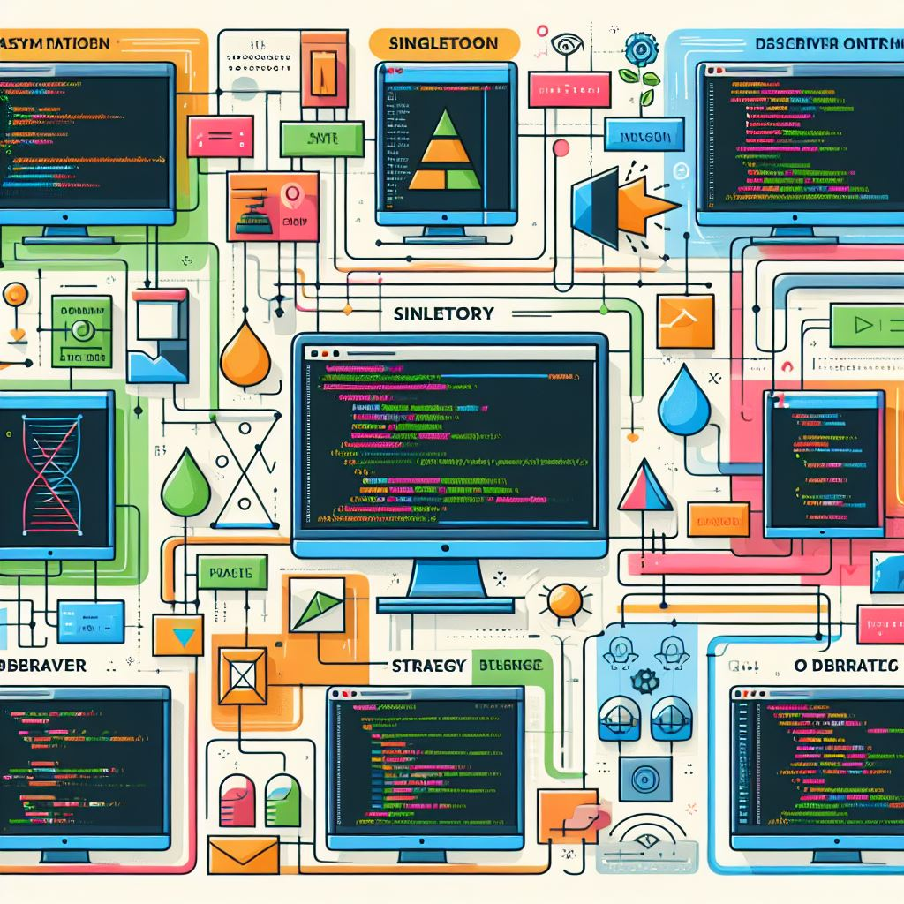

## What are design patterns

Design patterns are like blueprints for software development, providing general, reusable solutions to common design problems. They encapsulate expert knowledge and best practices, making it easier to create scalable and maintainable software systems. Design patterns can be categorized into three types: Creational, which abstracts the process of object creation; Structural, which deals with class and object composition; and Behavioral, which focuses on communication and responsibilities between objects. They provide a common language that enhances team communication efficiency.

They serve as a critical tool in software development, offering a framework that encourages code reusability and system maintainability. By consistently applying these patterns across various applications, developers can enhance the manageability of their code, reducing the likelihood of bugs and errors. More than just providing immediate solutions, design patterns are designed to foster systems that are capable of evolving over time. Hence, they play an indispensable role in the creation of superior software.

## My use of design patterns

In the course of my software engineering studies, I’ve been incorporating a range of design patterns into my coding assignments. For instance, I’ve utilized both the prototype and constructor patterns to either clone or create objects. These creational strategies have significantly enhanced the flexibility and efficiency of my code. In a project involving Meteor, I implemented the Observer and MVC patterns to effectively decouple objects and manage their interactions in a manner that’s both flexible and extendable. The observer pattern has proven to be especially useful in managing request-response cycles, while the MVC pattern has facilitated the segregation of concerns into independent components, thereby enhancing the manageability and maintainability of the application. Furthermore, I employed the Front Controller approach to centralize the processing of incoming requests, thereby reducing redundancy and enhancing maintainability.