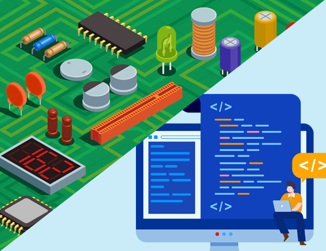

*What is Engineering?*

Engineering is a broad discipline that applies scientific and mathematical principles to design, build, and maintain structures, machines, systems, and processes. It involves the creative application of these principles to develop solutions that meet societal needs and improve the quality of life.

## Me

Throughout my early education, I found little that sparked my interest. However, this changed during high school when I stumbled upon a class dedicated to electronics. The concept of designing and constructing something from scratch was truly fascinating to me. Did this newfound interest make me enjoy all my other classes? Not necessarily. However, I began to approach them with a renewed focus, knowing that achieving good grades would be crucial for my future career to design and build things. Neared the end of my high school journey, I encountered a programming class. I found that programming bore a striking resemblance to circuit design - both involved starting with a goal and methodically crafting parts to achieve it.

I decided to pursue Computer Engineering as my major, fully aware that it would encompass both circuit design and programming. So far, the programming course that I have tooken was great. However, the circuit course didn’t quite meet my expectations as they were predominantly mathematical from start to finish. I found the hands-on practices in the programming course to be far superior to those in my circuit class. When I discovered a class on Software Engineering, I didn’t hesitate to enroll, knowing that I would learn about various libraries and useful frameworks in a single course.

## My take on programming

Programming is a fascinating and rewarding activity, but it can also be daunting and frustrating at times. There are so many programming languages to choose from, each with its own syntax, features, and libraries. I love the feeling of creating something from scratch, solving problems, and expressing my ideas in code. The diversity and richness of programming languages can sometime be overwhelming, however programming to me is not just a skill, but a passion and a hobby.