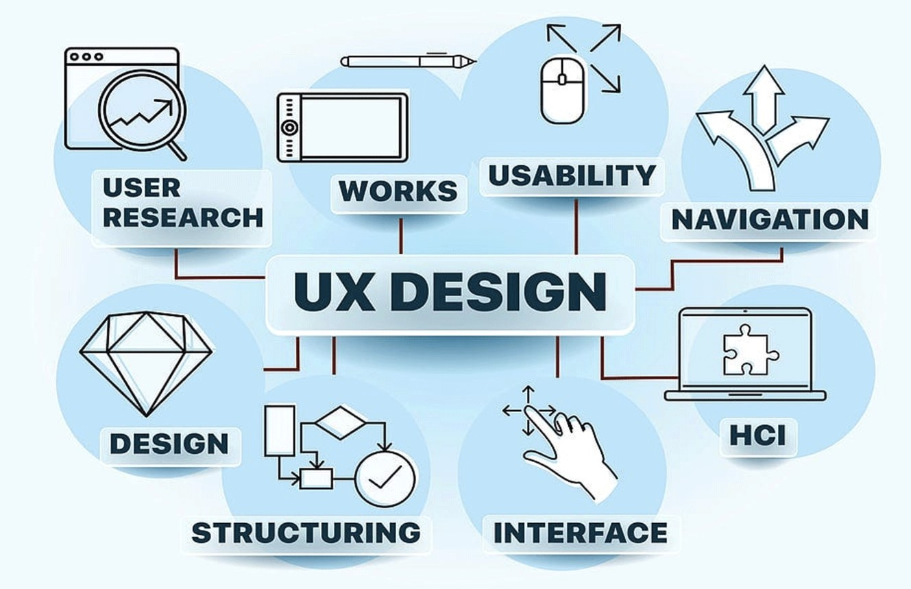

*The big question*

Deciding between using UI frameworks like Bootstrap 5 or sticking to plain HTML and CSS is an ongoing debate. While going for simple HTML and CSS might seem easy, taking the time to learn a UI framework can bring many advantages beyond just making things look good.

## HTML/CSS

Basic websites can be made using just HTML and CSS—they're like the building blocks of a website's structure and style. It's a straightforward choice for simple or personal projects. But when things get more complicated, keeping the code easy to manage and expand becomes a tough task. At first glance, using raw HTML and CSS might appear to be a quicker path to web development. However, this initial speed can quickly turn into a hindrance as projects expand and require consistent styling and responsiveness across various devices. 

## UI Framework

UI frameworks like Bootstrap 5 provide pre-designed components, layouts, and utilities, significantly cutting down on time spent on repetitive tasks. Instead of reinventing the wheel for each project, developers can use a UI framework to speed up development without sacrificing quality. UI frameworks aren't just shortcuts; they embody solid software engineering principles. They encourage modularization, encapsulation, and code reusability, promoting a more maintainable and scalable codebase. This allows developers to focus on the unique aspects of their projects, relying on the tested and optimized components from the framework for common functionalities. This approach improves collaboration, streamlines development workflows, and makes maintenance and updates easier.

