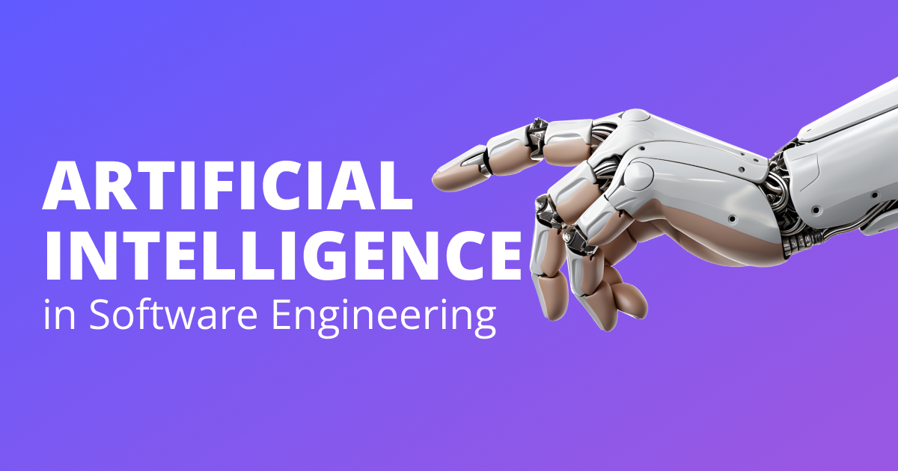

### I. Introduction
Artificial Intelligence (AI) has been a transformative force in various fields, and education, they plays a pivotal role in automating tasks, optimizing systems, and enhancing the overall efficiency of software development processes. Throughout my journey in ICS 314, I  had the opportunity to explore and utilize several AI tools such as ChatGPT and GitHub Copilot. 

### II. Personal Experience with AI:
I have used AI in class this semester in the following areas:

  1. Experience WODs e.g. E18
    
    I haven't utilized AI for the WOD experience because there were screencast videos available in case I encountered any difficulties.

  2. In-class Practice WODs

    I have utilized AI for some In-class practice WODs, many just GitHub Copilot as it auto completes my code and save me some time

  3. In-class WODs

    When I was still getting used to React.js, for one of the WODs. The task was to transform a standard HTML webpage into a React.js webpage. I remember seeking assistance from ChatGPT to automatically convert the HTML code to React.js. Another occasion when use ChatGPT for WOD was when I was running late for class. When I got to class, I asked ChatGPT to generate the entire solution for me. To my surprise, it worked out perfectly.

  4. Essays

    I have certainly utilized AI to assist me with essay writing, primarily for grammar checks and rephrasing my sentences. Writing has always been a challenge for me, but using AI has enabled me to express myself more professionally.

  5. Final project

    For my final project, I utilized Copilot for auto-completion assistance and engaged ChatGPT to generate aesthetically pleasing CSS styles, enhancing the overall presentation.

  6. Learning a concept / tutorial

    I haven't utilized AI for learning concepts, as I tend to prefer watching YouTube videos or browsing through multiple pages on Google.

  7. Answering a question in class or in Discord

    I have not answer a question in class or on discord.

  8. Asking or answering a smart-question
  
    I have not ask nor answer a smart-question.

  9. Coding example e.g. “give an example of using Underscore .pluck”
  
    I haven't asked AI for coding examples. Typically, I would search for coding examples on Google and review various pages to understand them. Although I do think asking ChatGPT or other AI systems seems quite useful, though there's a chance they might generate faulty code.

  10. Explaining code
  
    I have utilized AI to assist in explaining code. In one of my previous classes, we dealt with the MIPS architecture, and I certainly didn't have any prior knowledge of MIPS Machine Language.

  11. Writing code

    I have utilized AI to assist in writing code. As mentioned before, I use it to generate codes for WODs and on the Final Project.

  12. Documenting code

    I have not use AI to document any codes, as I almost never document my code. I need to stop this bad habit and start documenting my code more.

  13. Quality assurance

    I haven't used AI for quality assurance. In ICS 314, we rely on ESLint for maintaining code quality. In other classes, I tend to follow my own preferred code formatting style.

  14. Other uses in ICS 314 not listed above

    Pretty much all have been listed here.

### III. Impact on Learning and Understanding:
Incorporation of AI has definly influenced my learning experience. For instance, AI has simplified the process of understanding complex concepts, such as the MIPS Machine Language. With AI, I was able to comprehend each machine instruction line by line, eliminating the need to source the internet for explanations. This not only made learning more efficient but also less time-consuming. However, it’s important to strike a balance and not become overly dependent on AI. While AI can be a powerful tool for learning, over-reliance could potentially hinder the development of critical thinking and problem-solving skills. 

### IV. Practical Applications:
Artificial Intelligence is extensively employed in real-world projects, simulations, and collaborative activities. A significant application of AI lies in its ability to automate a variety of software development tasks, boosting productivity and efficiency. For example, AI-powered tools can automatically generate code snippets, perform code refactoring, and assist in bug detection and fixing. This automation of software engineering routines allows human developers to focus more on complex and interesting problems, thereby multiplying their creative potential.

### V. Challenges and Opportunities:
While utilizing AI, I encounter certain challenges such as the inability to consistently provide precise answers and the potential risk of becoming excessively dependent on these tools. Despite the challenges, the incorporation of AI into software engineering education opens up numerous opportunities. These include employing AI to review code and offer constructive feedback, as well as developing AI-driven tutors capable of delivering personalized learning experiences.

### VI. Comparative Analysis:
Traditional teaching methods in software engineering education, while effective, often rely on one-size-fits-all lectures and assignments, which may not cater to the individual learning styles of students. This can lead to varying levels of engagement and knowledge retention. On the other hand, AI-enhanced approaches offer personalized learning experiences, adapting to each student’s pace and style of learning, thereby potentially increasing engagement and knowledge retention.

### VII. Future Considerations:
AI is poised to play a transformative role in the future of software engineering education. With advancements in machine learning and natural language processing, AI can provide personalized learning experiences, instant feedback, and even simulate real-world coding environments. This can lead to improved engagement, knowledge retention, and practical skill development. However, there are challenges to overcome. The effectiveness of AI-enhanced learning heavily depends on the quality and diversity of the data it’s trained on. Biases in the data can lead to biases in educational outcomes. Moreover, the risk of over-reliance on AI tools may hinder the development of critical thinking and problem-solving skills.

### VIII. Conclusion:
In summary, the moderate use of AI in the ICS 314 course proved to be both beneficial and enlightening. It’s crucial to educate students on the balanced use of AI and the potential pitfalls of over-reliance on it, to ensure they graduate with solid fundamental skills. While AI is a powerful tool that’s continually improving, students need to be cognizant of the potential challenges they could face if they become overly dependent on it.