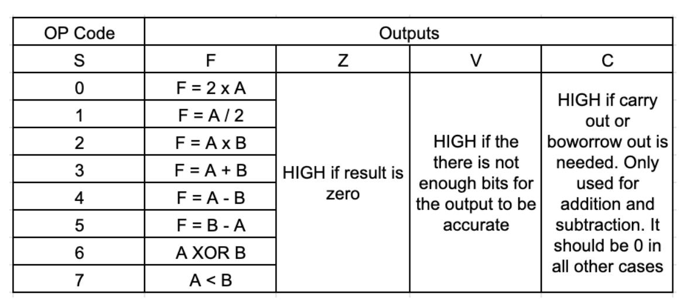
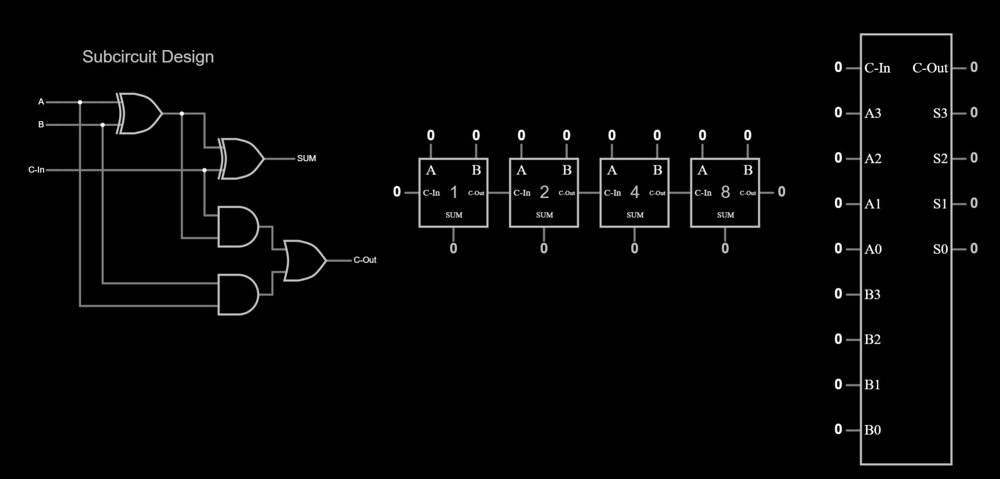
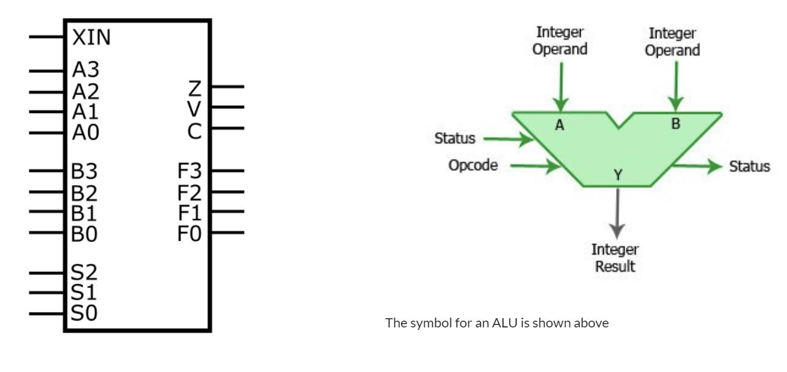

<div class="text-center p-4">
  
  <p class="fst-italic">Complete ALU circuit implementation in Falstad simulator</p>
</div>

## Project Overview
This project involved designing and implementing a 4-bit Arithmetic Logic Unit (ALU) capable of performing eight distinct operations. The ALU supports fundamental computer arithmetic including addition, subtraction, multiplication, division, and bitwise operations. The design process involved both hardware simulation using Falstad circuit simulator and Hardware Description Language (HDL) implementation using Verilog.

## Design Process
Each operation was first prototyped individually in Falstad to verify the logic and ensure correct functionality. The subcircuits were then combined using multiplexers to create the complete ALU. The design follows these specifications:

- Input width: 4 bits (A, B inputs)
- Operation selection: 3 bits (allowing 8 operations)
- Carry in support (XIN)
- Status flags: Zero (Z), Overflow (V), Carry out (C)

<div class="text-center p-4">
  
  <p class="fst-italic">4-bit adder subcircuit implementation</p>
</div>

## Supported Operations
The ALU implements the following operations selected by the 3-bit control signal (S):
- 000: Addition (A + B + XIN)
- 001: Subtraction (B - A + XIN)
- 010: Subtraction (A - B + XIN)
- 011: Multiplication by 2 (A × 2)
- 100: Division by 2 (A ÷ 2)
- 101: Multiplication (A × B)
- 110: XOR (A ⊕ B)
- 111: Compare (A < B)

<div class="text-center p-4">
  
  <p class="fst-italic">Complete ALU integration with multiplexer control</p>
</div>

## Verilog Implementation
The ALU was implemented in Verilog HDL, incorporating all operations and status flags. Key features include:

```v
// filepath: module implementation
module fourBitALU ( XIN, A, B ,S, Z, V, C, F ) ;
  // ...existing code...
endmodule
```

The design demonstrates fundamental concepts in digital logic design and computer architecture, providing practical experience with both hardware simulation and HDL-based design methodologies.
