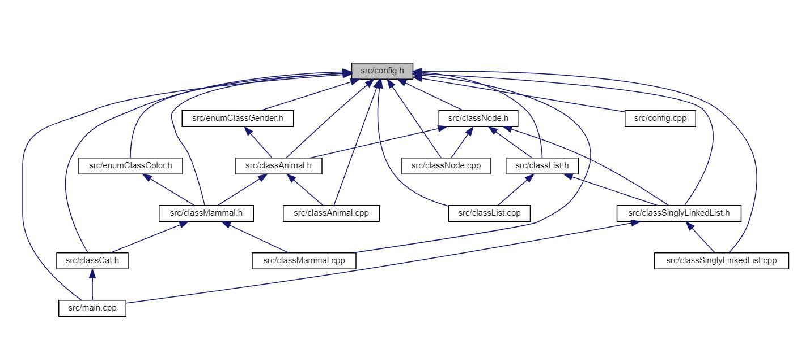

<div class="text-center p-4">
  
  <p>Animal Farm Class Hierarchy Visualization</p>
</div>

This project implements a comprehensive animal management system in C++, showcasing Object-Oriented Programming (OOP) principles and software engineering best practices. You can find the complete source code on [GitHub](https://github.com/XiaoKChenEdu/ee205-Animal-Farm).

## Project Overview

The Animal Farm project demonstrates several key programming concepts:

- Class inheritance hierarchy (Animal → Mammal → Cat)
- Multiple database implementations:
  - Array-based storage with separate attribute arrays
  - Struct-based array storage
  - Procedural singly linked list
  - Object-oriented collection class with polymorphic Animal objects
- Automated documentation generation using Doxygen
- Unit testing and validation

## Implementation Details

The project features a robust class hierarchy where each class has specific responsibilities:

- `Animal`: Base class providing core attributes like weight, gender
- `Mammal`: Extends Animal with mammal-specific features like color
- `Cat`: Concrete class with cat-specific attributes and behaviors

Some example of the object in Animal Farm :

```cpp
 class classCat : public classMammal {
  
     protected:
     ///// Protected Attributes /////
         string name       ;
         bool   isCatFixed = false ;
     ///// Protected Attributes /////
  
     public:
     ///// Static Public Attributes /////
         static const string                SPECIES_NAME ;
         static const classWeight::t_weight MAX_WEIGHT   ;
     ///// Static Public Attributes /////
  
     public:
     ///// Constructor /////
         classCat( const string                &NewName    ) ;
         classCat( const string                &NewName,
                   const Color                 newColor,
                   const bool                  newIsFixed,
                   const Gender                newGender,
                   const classWeight::t_weight newWeight   ) ;
     ///// Constructor /////
  
     public:
     ///// Getters /////
         string getName() const noexcept ;
         bool   isFixed() const noexcept ;
     ///// Getters /////
  
     ///// Setters /////
         void setName ( const string &NewName )          ;
         void fixCat  ()                        noexcept ;
     ///// Setters /////
  
     public:
     ///// Static Public Member Function /////
         static bool validateName( const string &NewName ) ;
     ///// Static Public Member Function /////
  
     public:
     ///// Validation & Print /////
         string speak    () const noexcept override ;
         void   print    () const noexcept override ;
         bool   validate () const noexcept override ;
     ///// Validation & Print /////
  
     public:
     ///// Debug Print /////
         void debugPrint() const noexcept override ;
     ///// Debug Print /////
  
 };
```

## Learning Outcomes

Through this project, I gained experience in:
1. Implementing inheritance and polymorphism in C++
2. Managing memory in complex data structures
3. Writing maintainable and documented code
4. Using development tools like Doxygen for documentation
5. Applying software engineering principles to a real-world problem

## Tools & Technologies

- C++17
- CMake build system
- Doxygen documentation generator
- GitHub for version control
