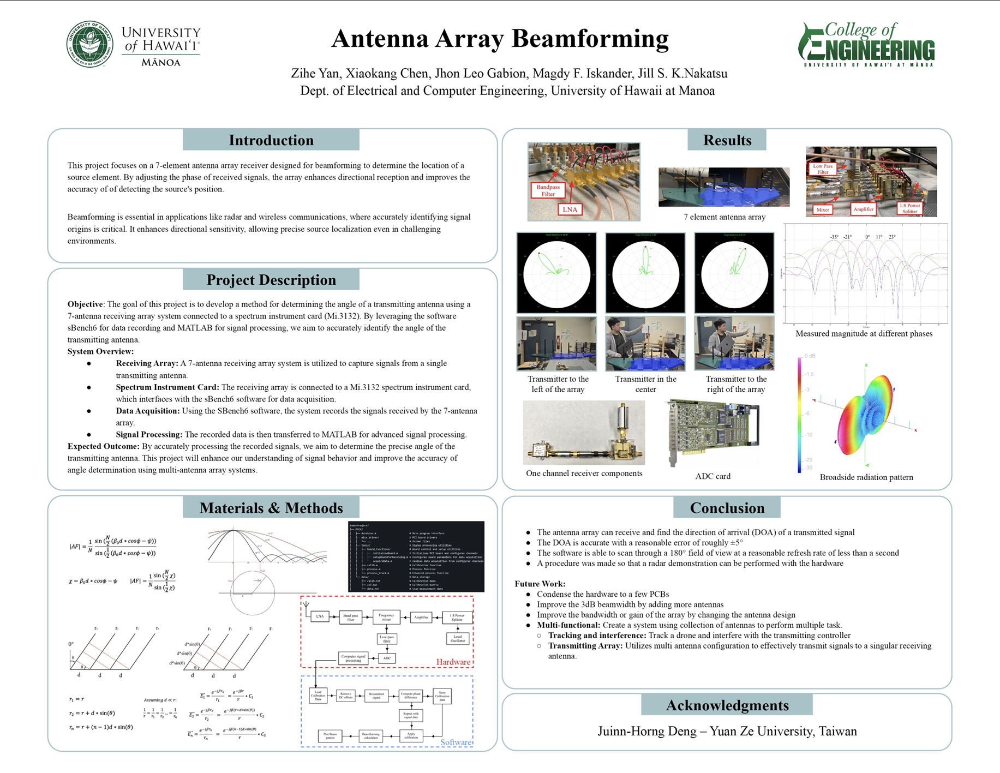

In this project, we explored the fundamental concepts of antenna array beamforming, a crucial technology in modern wireless communications. Using MATLAB, I developed simulations to analyze and visualize how multiple antenna elements can be coordinated to form directional beam patterns.

## Project Overview

The project focused on implementing various beamforming algorithms and studying their effects on signal transmission and reception. Key accomplishments include:

- Developed MATLAB simulations
- Implemented adaptive beamforming algorithms to optimize signal-to-noise ratio (SNR)
- Analyzed radiation patterns and beam steering capabilities
- Evaluated system performance under different signal conditions

You can find the project code and documentation in my [GitHub repository](https://github.com/XiaoKChenEdu/MICX_31XX).

## Technical Implementation

The implementation involved creating detailed mathematical models for:
- Array factor calculations
- Phase shifting and amplitude weighting
- Direction of arrival (DOA) estimation

## Results and Impact

Through this project, I gained practical experience in:
- RF signal processing techniques
- Antenna array theory and design principles
- Digital beamforming algorithms
- MATLAB programming for signal processing applications

This work provided valuable insights into modern wireless communication systems and their optimization techniques.
