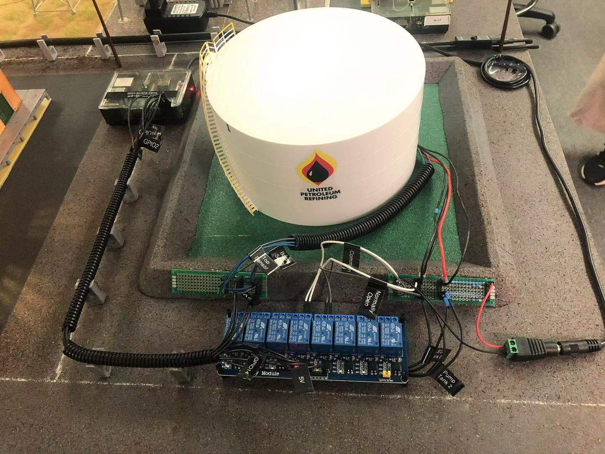
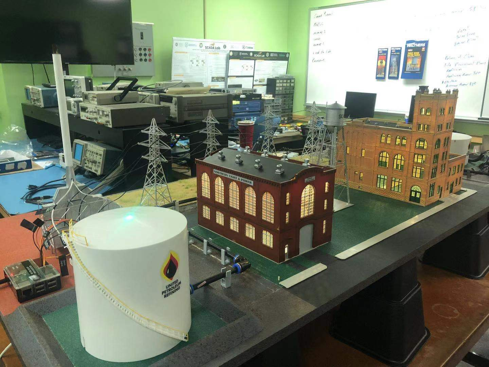
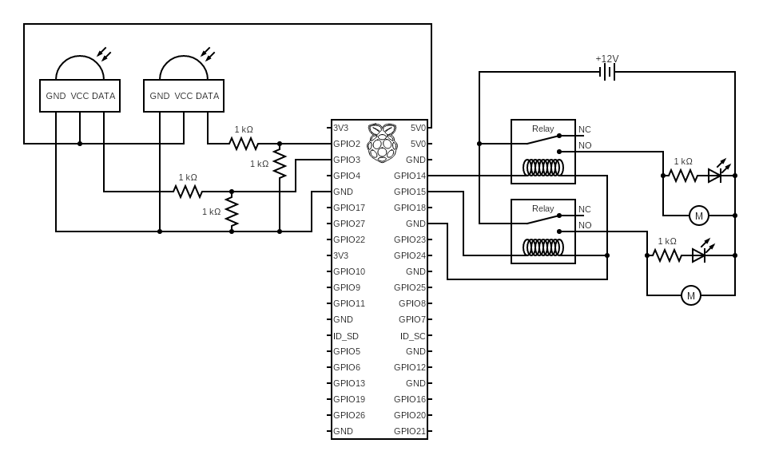

<div class="text-left p-4">
  
  
</div>

The SCADA Water/Oil system, a key component of a mini town design, was developed to illustrate the concept of a closed-loop system. This system includes two separate tanks, although only one is filled at a time. The flow of water is controlled by a Raspberry Pi. These two tanks are strategically positioned on opposite sides of the mini tower and are interconnected by a tube.

<div class="text-center p-4">
  
</div>

In this project, my primary responsibilities were the circuit design and programming of the Raspberry Pi. As depicted in the image above, I wired two water level sensors into the Raspberry Pi, enabling it to control which pump should be activated. Each tank is equipped with a pump, and an LED indicator is present to show which pump is currently in operation.

Here is some code that illustrates how the Raspberry controls the relay which than controls the pumps:

```py
import RPi.GPIO as GPIO
import time

GPIO.setmode(GPIO.BCM)

GPIO.setup(2, GPIO.IN, pull_up_down=GPIO.PUD_DOWN)  # Tank 1 Sensor
GPIO.setup(3, GPIO.IN, pull_up_down=GPIO.PUD_DOWN)  # Tank 2 Sensor
GPIO.setup(14, GPIO.OUT)                            # Output To Relay 1 (Pump 1)
GPIO.setup(15, GPIO.OUT)                            # Output To Relay 2 (Pump 2)

try:
    GPIO.output(14,0)
    while True:
        if (GPIO.input(2) == GPIO.LOW):     # Tower Tank Top Sensor Cover With Water
            GPIO.output(14,0)               # Close The Relay 1 (Pump 1 ON)
            GPIO.output(15,1)               # Open The Relay 2 (Pump 2 OFF)
            print("Pump 1 [ON], Pump 2 [OFF]")
        elif (GPIO.input(3) == GPIO.HIGH):  # Tower Tank Bot Sensor Not Cover With Water
            GPIO.output(14,1)               # Open The Relay 1 (Pump 1 OFF)
            GPIO.output(15,0)               # Close The Relay 2 (Pump 2 ON)
            print("Pump 1 [OFF], Pump 2 [ON]")
        time.sleep(0.1)

finally:
    GPIO.cleanup()
```
