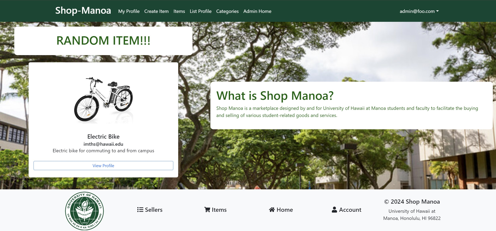

## Shop-Manoa
Shop-Manoa is a web application, the brainchild of a six-member team, honed with the skills and concepts acquired in the ICS 314 course. This application serves as an efficient marketplace tailored for campus-specific items, promoting their recycling and reuse. It provides a platform for UHM students, faculty, and staff to trade goods and services related to student life.

The link to the organization page can be found <a href="https://shop-manoa.github.io/">here</a>

## Contributions
<li> Create List Profile Page </li>
<li> Create/Optimized Profile Page </li>
<li> Optimize Item List Page </li>
<li> Optimize Sign Up Page </li>
<li> Web Design Clean Up </li>

## What I've Learned
During the execution of this project, I’ve amassed a wealth of practical skills and knowledge. First and foremost, I learned the art of effective team collaboration. Next, I gained hands-on experience in building a website using Meteor React, which encompassed tasks such as layout design, functionality implementation, and feature addition. I also mastered the skill of resolving merge conflicts, a critical aspect of team-based development. Finally, I learned the strategy of decomposing a project into a sequence of milestones, which enhanced our efficiency and enabled us to complete the project within the stipulated timeline.