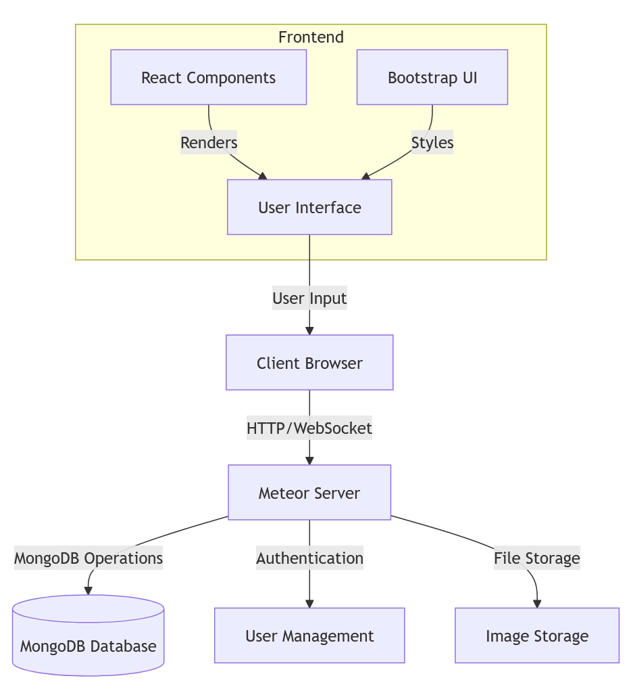
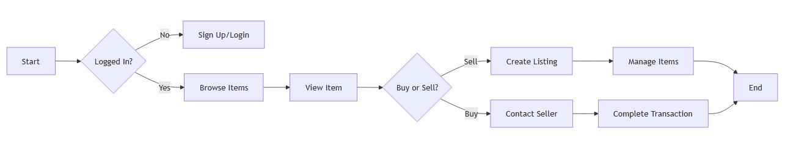
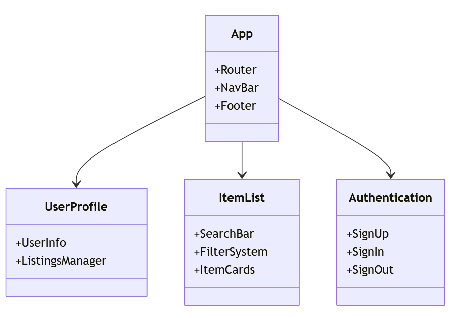

## Overview
Shop-Manoa is a comprehensive marketplace web application developed as a final project for ICS 314. Built using Meteor and React, it serves as a dedicated platform where UH Manoa students, faculty, and staff can buy, sell, or trade campus-related items. The application promotes sustainability through the reuse and recycling of academic materials and student life essentials.

You can explore the project through these links:
- [Organization Page](https://shop-manoa.github.io/)
- [Source Code](https://github.com/shop-manoa/shop-manoa)

## System Architecture

  

  <em>Figure 1: Shop-Manoa System Architecture Diagram</em>

## User Flow

  

  <em>Figure 2: User Flow Diagram showing the application's navigation paths</em>

## Component Structure

  

  <em>Figure 3: React Component Structure Diagram</em>

## Features
- User authentication and profile management
- Item listing with detailed descriptions and images
- Category-based browsing
- Search functionality
- Responsive design for mobile and desktop
- Real-time updates using Meteor's reactive data

## My Contributions
- Designed and implemented the Profile Page with user information display and editing capabilities
- Created the List Profile Page for managing user listings
- Enhanced the Item List Page with improved filtering and sorting features
- Optimized the Sign Up Page for better user experience
- Implemented responsive design principles across multiple pages
- Conducted code reviews and resolved merge conflicts
- Participated in milestone planning and documentation

## Technical Skills Applied
- Frontend Development: React, Bootstrap 5
- Backend Development: Meteor, MongoDB
- Version Control: Git, GitHub
- Project Management: Issue tracking, Milestone planning
- Testing: TestCafe

## What I Learned
Through this project, I gained valuable experience in:
- Full-stack web development using the Meteor framework
- Agile development methodologies and team collaboration
- Git workflow and merge conflict resolution
- UI/UX design principles and implementation
- Database design and management
- Deployment and hosting considerations
- Creating and maintaining technical documentation